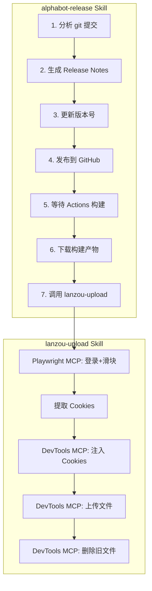

# 标题选项

1. **吸引眼球型**：「一文搞懂 MCP、Skill、Rule，AI 编程三剑客入门指南」
2. **争议对立型**：「别再傻傻分不清！MCP、Skill、Rule 到底有啥区别？」
3. **口语化**：「MCP、Skill、Rule 傻傻分不清？这篇讲人话的科普来了」
4. **自嘲式**：「被群友问懵了，我决定写篇文章一次性说清楚」
5. **专业权威型**：「从原理到实践：Cursor 用户必懂的三个核心概念」

# 摘要

最近在技术群里被问到 MCP、Skill、Rule 这几个概念，发现很多刚入门的朋友容易搞混。这篇文章用大白话拆解这三个东西到底是干嘛的、有啥区别，顺便分享几个我自己在用的 Skill 实战案例。看完你就能分清谁是给 AI 装"手"的，谁是给 AI 发"工作手册"的，谁是给 AI 立"规矩"的。

# 封面图建议

**AI 生图关键词**：
- 主题：三个齿轮/工具图标并排，分别标注 MCP/Skill/Rule
- 风格：扁平化科技风、简约线条、深色背景
- 配色：蓝紫渐变 + 白色图标
- 尺寸：900x383（公众号头图比例 2.35:1）

---

# 正文

# 背景

最近在技术交流群里，经常有人问我："MCP 和 Skill 有啥区别？"、"Rule 是不是跟 Skill 差不多？"

说实话，这几个概念确实容易搞混，我自己刚接触的时候也是一脸懵。后来用多了才慢慢理清楚它们各自的定位。

既然群里问的人多，干脆写篇文章一次性说清楚，省得每次都要重复解释。

# 1、先用一句话说清楚

在深入之前，先记住这三句话：

- **MCP**：给 AI 装上"手"，让它能用各种工具
- **Skill**：给 AI 一本"工作手册"，告诉它 1、2、3 应该怎么干活
- **Rule**：给 AI 立"规矩"，规定什么能干、什么不能干

就这么简单。接下来展开讲讲。

# 2、MCP：让 AI 长出"手"

## 大白话解释

MCP 全称 Model Context Protocol，是 Anthropic（就是 Claude 背后那家公司）在 2024 年底开源的一个协议。

它解决的问题很简单：**套个壳（统一协议），让 AI 能调用已有的那些工具**。

你想啊，市面上有各种各样的工具：数据库、文件系统、GitHub、Slack、日历……每个工具的调用方式都不一样。如果每个 AI 应用都要单独对接，那不得累死？

MCP 就是来解决这个问题的。它定义了一套统一的"接口标准"，只要工具按照这个标准实现，任何支持 MCP 的 AI 应用都能直接调用。

## 类比理解

官方有个特别形象的比喻：**MCP 就像 USB-C 接口**。

以前各种设备的充电线都不一样，安卓用 Micro USB，苹果用 Lightning，笔记本用各种奇奇怪怪的接口。现在有了 USB-C，一根线走天下。

MCP 做的就是这个事情——让 AI 应用和各种工具之间有个统一的"接口"。

## 实际例子

Cursor 里面内置了好几个 MCP，比如：

**Playwright MCP**：让 AI 能操控浏览器
- 打开网页、点击按钮、填写表单
- 拖动滑块（这个很关键，后面会用到）
- 截图、执行 JavaScript

**Chrome DevTools MCP**：让 AI 能通过开发者工具操控浏览器
- 注入 Cookie、执行脚本
- 上传文件（Playwright 不支持的操作）
- 监控网络请求

这些 MCP 配置好之后，Cursor 里的 AI 就能直接调用这些能力了。你跟它说"帮我打开百度搜索一下 xxx"，它就真的能打开浏览器去搜。

# 3、Skill：给 AI 一本"工作手册"

## 大白话解释

Skill 也很简单：**用自然语言描述一个工作流，告诉 AI 1、2、3 应该怎么干**。

它本质上就是一个 Markdown 文件（通常叫 `SKILL.md`），里面写清楚：

- 这个技能是干嘛的
- 什么时候触发
- 具体步骤是什么

然后 AI 就会按照这个"手册"来执行任务。

## 跟脚本的区别（重点）

群里有人问："把 Skill 简单理解成脚本行不行？"

**不行**。

这是我在群里的回复：


脚本是死的，逻辑固定在代码里，永远不会变。

Skill 定义的是工作流，AI 会根据自然语言描述来完成对应的任务。关键区别在于：**AI 会自己判断和适应**。

举个例子：打开浏览器登录某个网站。

如果是脚本，你得写：
1. 打开登录页
2. 输入用户名密码
3. 点击登录按钮

但如果网站已经登录过了，脚本没写这个判断逻辑，就会卡死在"找登录按钮"这一步。

Skill 就不一样了。你只需要告诉 AI"登录这个网站"，它发现已经登录了，就会自动跳过登录步骤，直接进行下一步。

**脚本是死的，Skill 是活的。**

## 实际例子：AlphaBot 发版 Skill

先介绍一下背景。AlphaBot 是我用 AI 写的一个薅羊毛软件，支持 macOS 和 Windows，通过蓝奏云网盘分发给用户。每次发新版本都要做一堆重复的事情：写更新日志、打 tag、等 GitHub Actions 构建、下载产物、上传到蓝奏云、删掉旧版本……

手动搞一次要十几分钟，而且容易出错。

于是我写了一个 `alphabot-release` Skill，用自然语言描述整个发版流程。现在只要说一句"发布新版本 1.24.0"，AI 就会自动完成所有步骤。

更厉害的是，**Skill 还可以嵌套调用其他 Skill**。

`alphabot-release` 在最后一步会调用另一个 Skill `lanzou-upload`，专门处理蓝奏云上传。而 `lanzou-upload` 内部又会调用两个 MCP（Playwright 和 DevTools）来完成浏览器操作。

这种嵌套结构让工作流变得非常灵活：



看到了吗？**Skill 就是自然语言版的工作流，而且可以像函数一样互相调用，非常灵活**。

以前手动发版要十几分钟，现在一句话搞定。真香！

# 4、Rule：给 AI 立"规矩"

## 大白话解释

Rule 就更简单了：**规定 AI 要怎么干，不能干嘛**。

它跟 Skill 有点像，都是用自然语言描述的。但区别在于：

- **Rule 是一股脑告诉 AI 所有内容**，AI 在每次对话开始时就会加载
- **Skill 是告诉 AI"有这么个东西"，用的时候再来看**

## 类比理解

如果把 AI 比作一个新入职的员工：

- **Rule** 就是公司的《员工手册》，入职第一天就发给你，里面写着"代码要用 TypeScript"、"commit message 要用英文"、"禁止在生产环境直接改数据库"之类的规定
- **Skill** 就是《操作手册》，平时放在柜子里，需要做某件具体的事情（比如"发版"）时才拿出来看

## 实际例子

我的项目里有这样一条 Rule：

```markdown
---
description: 语言规范
alwaysApply: true
---

# 多语言项目规范

- 禁止 GUI 页面使用硬编码文案
- 所有文案必须使用统一的语言配置
- 语言文件路径：alpha_bot_gui/translations
```

这条规则 `alwaysApply: true`，意味着每次对话 AI 都会遵守。这样我就不用每次都提醒它"别硬编码"了。

# 5、三者对比

| 维度 | MCP | Skill | Rule |
|------|-----|-------|------|
| **解决的问题** | 让 AI 能调用工具 | 定义复杂工作流 | 设置行为规范 |
| **本质** | 统一的接口协议 | 自然语言工作手册 | 自然语言规则集 |
| **存放位置** | 各种 MCP Server | `~/.cursor/skills/` | `.cursor/rules/` |
| **触发方式** | AI 需要用工具时自动调用 | `/@skill-name` 或自动识别 | 始终生效或按需加载 |
| **灵活程度** | 工具能力固定 | AI 灵活执行 | 约束性规则 |
| **类比** | USB-C 接口 | 操作手册 | 员工手册 |

一句话总结：

- **MCP 给 AI 装"手"**（能力扩展）
- **Skill 给 AI 发"工作手册"**（流程指导）
- **Rule 给 AI 立"规矩"**（行为约束）

# 6、回答群友问题

## "这些在测试领域一般是怎么用的？"


测试领域其实很适合用 Skill，因为很多工作都是固定流程：

- **造数据**：按照特定规则生成测试数据
- **排查问题**：分析日志、定位 bug
- **设计功能用例**：根据需求文档生成测试用例
- **写自动化用例**：生成 pytest/playwright 代码

这些都是固定的工作流，很适合用 Skill 来解决。

现在已经有锤子了，就看钉子啦。

## "能分享个实际的 Skill 案例吗？"


上面已经介绍了 `alphabot-release` Skill，这里再说说它调用的 `lanzou-upload` Skill。

蓝奏云有个麻烦的地方：登录需要滑块验证。普通的浏览器自动化很容易被检测到，验证会失败。

我的解决方案是**双 MCP 协作**：

1. **Playwright MCP** 负责登录：它的鼠标模拟更真实，能通过滑块验证
2. 登录成功后，提取 Cookies
3. **Chrome DevTools MCP** 负责后续操作：注入 Cookies，上传文件，删除旧文件

为什么要用两个 MCP？因为 Playwright 上传文件有 bug，而 DevTools 的滑块验证会失败。各取所长，组合起来就完美了。

这就是 Skill 的灵活之处：**你用自然语言描述工作流，AI 会自己选择合适的工具来执行**。

# 7、总结

写到这里，再回顾一下核心要点：

**MCP**：统一协议，让 AI 能调用各种工具。就像 USB-C，一个接口适配所有设备。

**Skill**：自然语言工作流，告诉 AI 123 怎么干活。比脚本灵活，AI 会自己判断和适应。

**Rule**：行为规范，规定什么能干什么不能干。一股脑告诉 AI，每次对话都遵守。

**该用哪个？**

- 想让 AI 调用外部工具 → 找/写 MCP Server
- 有固定的工作流程想自动化 → 写 Skill
- 想让 AI 遵守某些规范 → 写 Rule

希望这篇文章能帮你理清这几个概念。如果还有问题，欢迎在评论区留言~

---

*最后，感谢群友们的提问，没有你们就没有这篇文章。*
